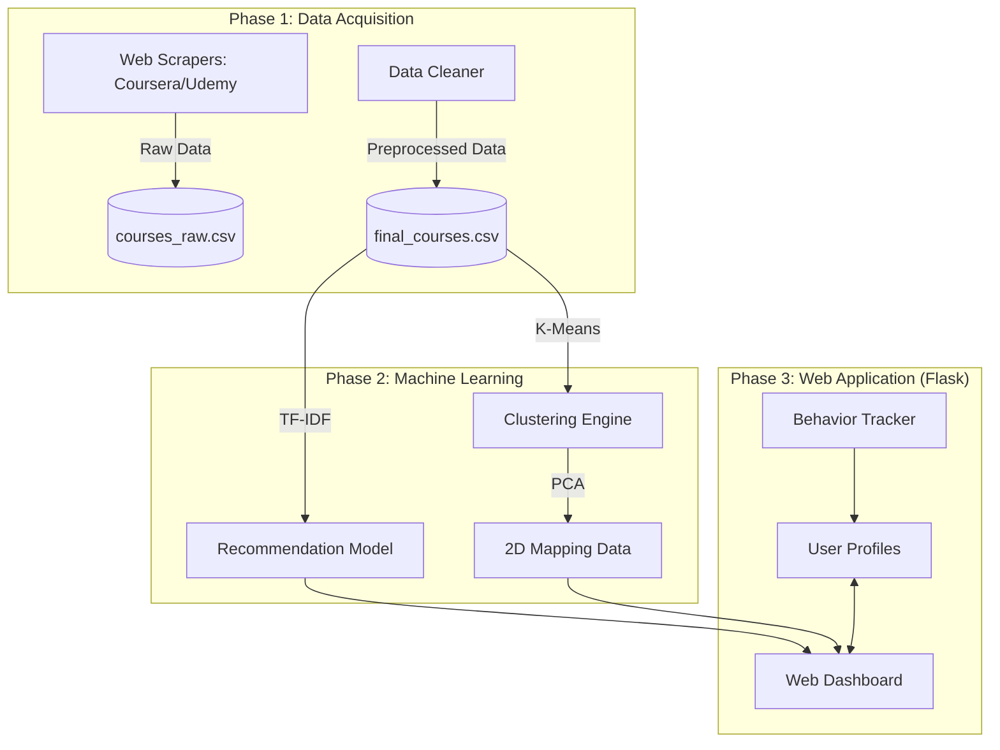

# 🎓 Course Recommendation Platform: Full Documentation

This document provides a comprehensive overview of how the entire registration, scraping, analysis, and recommendation platform works.

---

## 🏗️ 1. High-Level Architecture

The platform is built using a **Modular Data-Driven Architecture**. It separates the data collection from the intelligence engine and the web delivery.

### System Diagram

---

## 🛠️ 2. Step-by-Step Technical Workflow

### Step 1: Automated Data Collection (Scraping)

- **Coursera**: Uses `Playwright` to simulate a real browser, handling dynamic JavaScript content that basic scrapers can't see.
- **Udemy**: Uses `BeautifulSoup` and requests to parse HTML structure.
- **Result**: A consolidated dataset with titles, descriptions, categories, levels, ratings, and URLs.

### Step 2: Data Preprocessing & Cleaning

- **Normalization**: Converting various price formats and rating scales into a standard format.
- **Keyword Extraction**: Extracting essential metadata (level, category) from descriptions if missing.
- **Deduplication**: Removing duplicate courses and ensuring `course_id` consistency.

### Step 3: Building the Intelligence (ML Training)

The system doesn't just search for keywords; it understands relationships:

1.  **Vectorization**: It converts text (Title + Category + Level) into mathematical vectors using **TF-IDF**.
2.  **Similarity Matrix**: It calculates the **Cosine Similarity** between every single pair of courses.
3.  **Clustering**: It groups the 1100+ courses into **10 distinct clusters** (e.g., "Web Dev", "Data Science") using the **K-Means** algorithm.

### Step 4: Personalization Engine

When you log in, the system builds your profile:

- **Direct Search**: Instantly vectorizes your query and finds the closest matches in the vector space.
- **Behavior Tracking**: Every click and search is saved. The system calculates your "Top Categories".
- **Hybrid Recommendation**: The home page combines:
  - Recent search results.
  - Top-rated courses from your favorite categories.
  - Popular global courses to ensure discovery.

### Step 5: Interactive Visualization

The "Clustering" page uses **PCA (Principal Component Analysis)** to flatten the complex 900+ dimension data into a simple 2D map. This allows users to browse courses visually, seeing "galaxies" of related topics.

---

## 📂 3. Project Directory Map

- `/scrapers`: The "Eyes" - Collecting raw data.
- `/models`: The "Brain" - Recommendation and Clustering logic.
- `/data`: The "Memory" - CSV files and User behavior.
- `/templates`: The "Face" - Modern UI designed with HTML/CSS.
- `app.py`: The "Heart" - Orchestrating everything via Flask.

---

## 🚀 4. Technical Stack

- **Backend**: Python, Flask
- **Database**: JSON-based User Management
- **Machine Learning**: Scikit-Learn (TF-IDF, Cosine Similarity, K-Means, PCA)
- **Scraping**: Playwright, BeautifulSoup
- **Frontend**: Vanilla CSS, Jinja2, JavaScript (Chart.js for visualization)

---

_Created for SDIA Python Project - S7_
