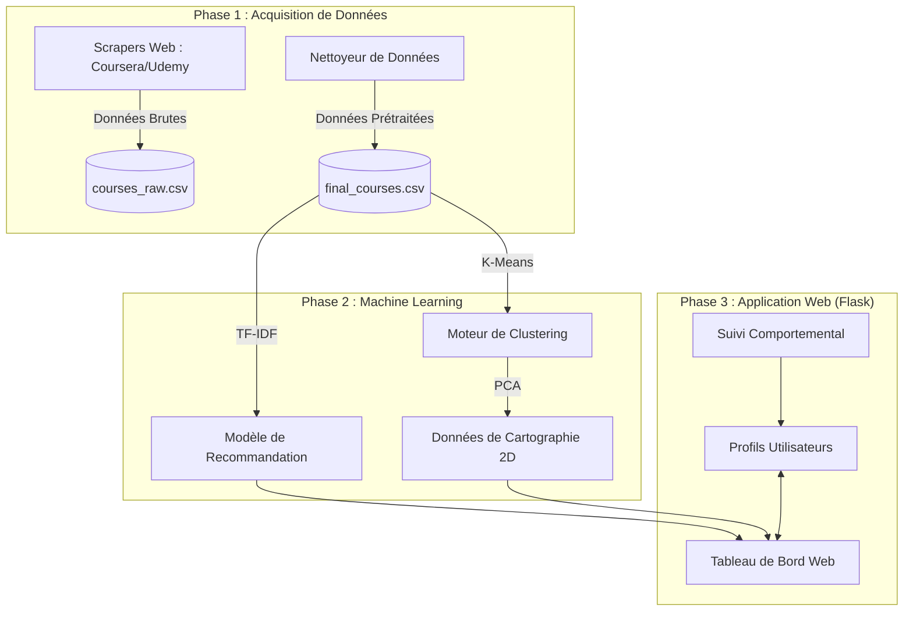

# 🎓 Plateforme de Recommandation de Cours : Documentation Complète

Ce document fournit une vue d'ensemble complète du fonctionnement de la plateforme d'inscription, d'extraction, d'analyse et de recommandation.

---

## 🏗️ 1. Architecture de Haut Niveau

La plateforme est construite sur une **Architecture Modulaire Orientée Données**. Elle sépare la collecte de données du moteur d'intelligence et de la livraison web.

### Diagramme du Système

---

## 🛠️ 2. Flux de Travail Technique Étape par Étape

### Étape 1 : Collecte Automatisée de Données (Scraping)

- **Coursera** : Utilise `Playwright` pour simuler un navigateur réel, gérant le contenu JavaScript dynamique que les scrapers basiques ne peuvent pas voir.
- **Udemy** : Utilise `Playwright` et des requêtes pour analyser la structure HTML.
- **Résultat** : Un jeu de données consolidé avec titres, descriptions, catégories, niveaux, notes et URL.

### Étape 2 : Prétraitement et Nettoyage des Données

- **Normalisation** : Conversion de divers formats de prix et échelles de notation en un format standard.
- **Extraction de Mots-Clés** : Extraction de métadonnées essentielles (niveau, catégorie) à partir des descriptions si manquantes.
- **Déduplication** : Suppression des cours en double et garantie de la cohérence des `course_id`.

### Étape 3 : Construction de l'Intelligence (Entraînement ML)

Le système ne cherche pas juste des mots-clés ; il comprend les relations :

1.  **Vectorisation** : Convertit le texte (Titre + Catégorie + Niveau) en vecteurs mathématiques utilisant **TF-IDF**.
2.  **Matrice de Similarité** : Calcule la **Similarité Cosinus** entre chaque paire de cours.
3.  **Clustering** : Regroupe les 1100+ cours en **10 clusters distincts** (ex. "Dév Web", "Data Science") utilisant l'algorithme **K-Means**.

### Étape 4 : Moteur de Personnalisation

Lorsque vous vous connectez, le système construit votre profil :

- **Recherche Directe** : Vectorise instantanément votre requête et trouve les correspondances les plus proches dans l'espace vectoriel.
- **Suivi Comportemental** : Chaque clic et recherche est enregistré. Le système calcule vos "Top Catégories".
- **Recommandation Hybride** : La page d'accueil combine :
  - Résultats de recherche récents.
  - Cours les mieux notés de vos catégories favorites.
  - Cours populaires mondiaux pour assurer la découverte.

### Étape 5 : Visualisation Interactive

La page "Clustering" utilise **PCA (Analyse en Composantes Principales)** pour aplatir les données complexes de plus de 900 dimensions en une carte 2D simple. Cela permet aux utilisateurs de parcourir les cours visuellement, voyant des "galaxies" de sujets connexes.

---

## 📂 3. Carte des Répertoires du Projet

- `/scrapers` : Les "Yeux" - Collecte des données brutes.
- `/models` : Le "Cerveau" - Logique de Recommandation et de Clustering.
- `/data` : La "Mémoire" - Fichiers CSV et Comportement utilisateur.
- `/templates` : Le "Visage" - UI Moderne conçue avec HTML/CSS.
- `app.py` : Le "Cœur" - Orchestration de tout via Flask.

---

## 🚀 4. Stack Technique

- **Backend** : Python, Flask
- **Base de Données** : Gestion Utilisateur basée sur JSON/SQLite/CSV
- **Machine Learning** : Scikit-Learn (TF-IDF, Similarité Cosinus, K-Means, PCA)
- **Scraping** : Playwright, BeautifulSoup
- **Frontend** : Tailwind CSS, JavaScript (Chart.js pour la visualisation)

---